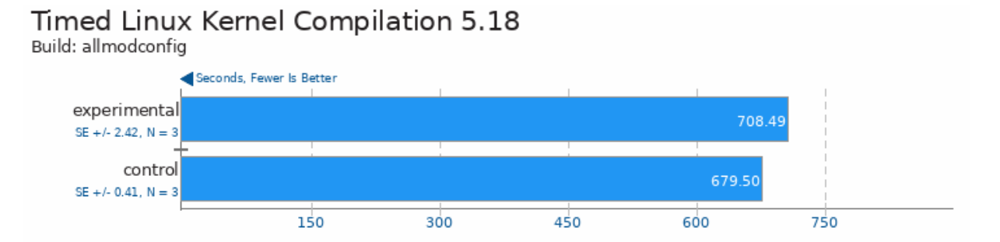

## WMO

Workload Memory Optimization using MGLRU based WSS estimation. The goal is to leverage the WSS information added by the following [patch](https://patchwork.kernel.org/project/linux-mm/list/?series=858486) in order to achieve memory efficiency gains with
little to no performance impact on workloads.


## Benchmarks

The benchmarks below are from [openbenchmarking.org](https://openbenchmarking.org/) and were executed using [phoronix-test-suite](http://www.phoronix-test-suite.com/) CLI.
For each benchmark, we will show the amount of memory savings we were able to get as well as report describing the performance impact of our memory reclaim policy.
The performance impact report is provided by the [phoronix-test-suite](http://www.phoronix-test-suite.com/) CLI. We will show a few screenshots here in this document, but all reports can be found in the benchmarks/$BENCHMARK/ directory.

### Timed Linux Kernel compilation

The policy used for this benchmark is to simply reclaim all bytes that are colder than 10s at a 40s period.

- Memory savings
```
peak memory usage (with our policy): 
peak memory usage (control): 
```

- Performance impact report ([full pdf](./benchmarks/linux-kernel/kenrelbench_report.pdf))



