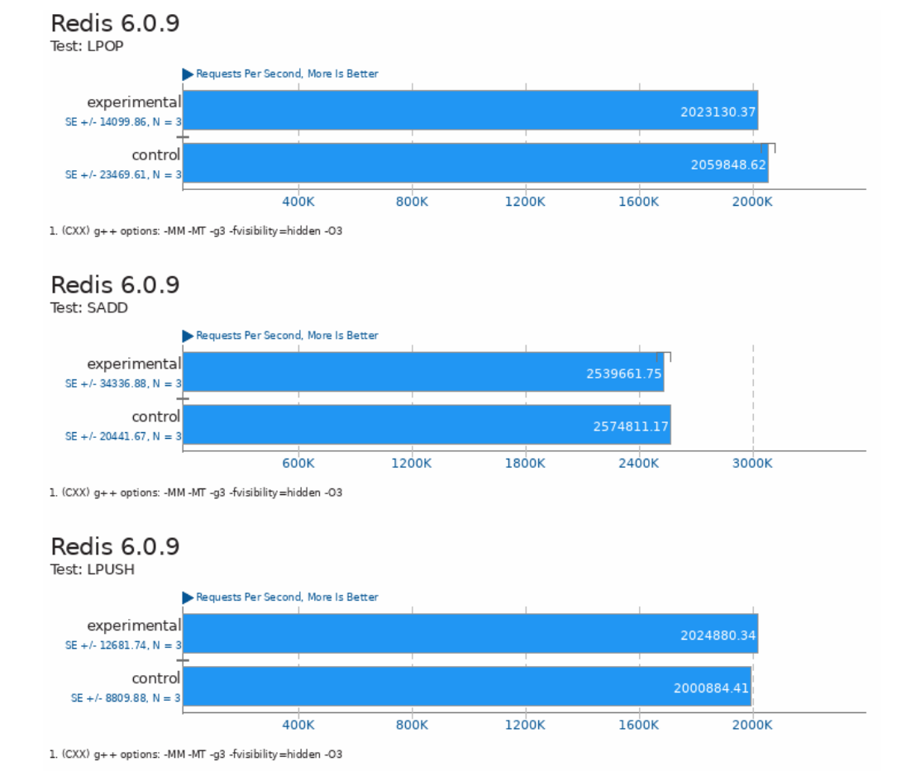

## WMO

Workload Memory Optimization using MGLRU based WSS estimation. The goal is to leverage the WSS information added by the following [patch](https://patchwork.kernel.org/project/linux-mm/list/?series=858486) in order to achieve memory efficiency gains with
little to no performance impact on workloads.


## Benchmarks

The benchmarks below are from [openbenchmarking.org](https://openbenchmarking.org/) and were executed using [phoronix-test-suite](http://www.phoronix-test-suite.com/) CLI.
For each benchmark, we will show the amount of memory savings we were able to get as well as a report describing the performance impact of our memory optimization policy.
The performance impact report is provided by the [phoronix-test-suite](http://www.phoronix-test-suite.com/) CLI. We will show a few screenshots here in this document, but all reports can be found in the benchmarks/$BENCHMARK/ directory.

### Reproducing the benchmark results

Benchmarks are executed using the [monitoring.py](./runtime/monitoring.py) script which is a simple wrapper around the phoronix-test-suite CLI. As the name suggests, this script simply starts the benchmark and collects stats.
Run the following commands to reproduce the linux kernel compilation benchmark.
```
sudo ./runtime/monitoring.py 'phoronix-test-suite benchmark build-linux-kernel' \
     --output=./stats.csv \
     --probing_freq_seconds=1 \
     --cgroup_refresh_interval='0,30000' \
     --node_page_age_intervals='0,1000,2000,3000,4000,5000,6000,7000,8000,9000,10000,11000,12000,13000,14000,15000' \
     --node_refresh_interval='0,30000' \
     --configure_node_workingset_information
```

This will run the benchmark, generate a performance report and dump the stats to the file specified in the --output command line flag.

To optimize the memory usage of the workload running (in the previous command). Run in a separate terminal the following command:
```
sudo ./runtime/agent.py $CGROUP_PATH --cold_age_threshold_ms=10000 --reclaim_freq_seconds=40
```
This will use the WSS information provided by MGLRU to try and optimize the memory usage (i.e. swap out cold memory to a lower tier storage backend -- SSD in our case).

Note: We assume that you already have [phoronix-test-suite](http://www.phoronix-test-suite.com/) installed. We also assume that the terminal from which you're running the command already runs in a cgroup (This assumption might be removed in the future).

### Timed Linux Kernel compilation

The policy used for this benchmark is to simply swap (swapfile stored in an SSD) out all bytes that are colder than 10s at a 40s period.

- Memory savings
```
peak memory usage (with WMO): 4982.61328 MiB
peak memory usage (control): 9569.1367 MiB
peak memory reduction: 47.9%
```

- Performance impact report ([full pdf](./benchmarks/linux-kernel/kernelbench_report.pdf))


### Redis

The policy used for this benchmark is to simply swap (swapfile stored in an SSD) out all bytes that are colder than 10s at a 40s period.

- Memory savings
```
peak memory usage (with WMO): 375.9023 MiB
peak memory usage (control): 509.765 MiB 
peak memory reduction: 26%
```

- Performance impact report ([full_pdf](./benchmarks/redis/redisbench_report.pdf))



